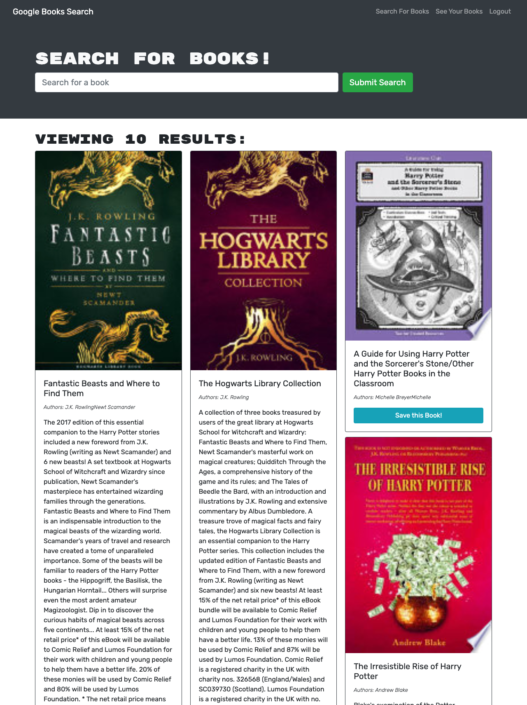

# Book Search

## Description
Book Search in an app where you can create an account, search for books through Google's API, and add books to a list.

Link - [Book Search](https://enigmatic-thicket-51832.herokuapp.com/)

## Table of Contents

[Usage](#usage)

[Questions](#questions)

## Usage
To use, go to [Book Search](https://enigmatic-thicket-51832.herokuapp.com/) and create an account and start searching!

## License
Licensed under Unlicense.
## Tests

## Questions
If you have any questions, here is a link to my github as well as my email address. Feel free to contanct me!

[Github](github.com/andysanchez726 "My Github")

[Email](andysanchez726@gmail.com "My Email")
  